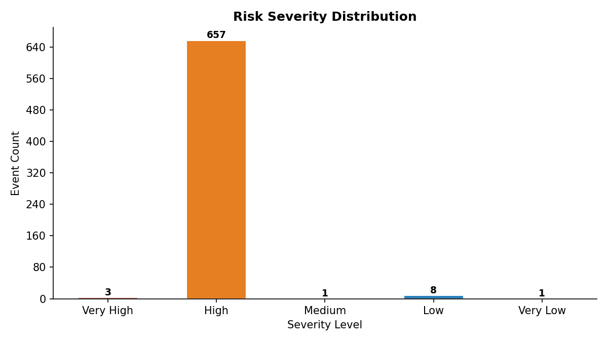
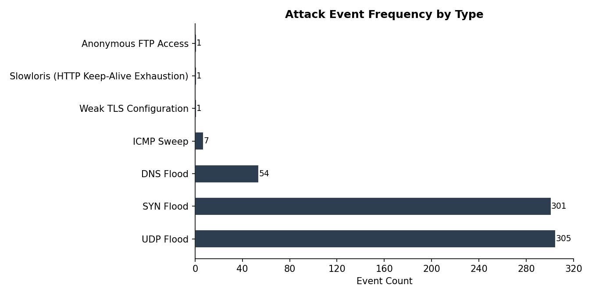
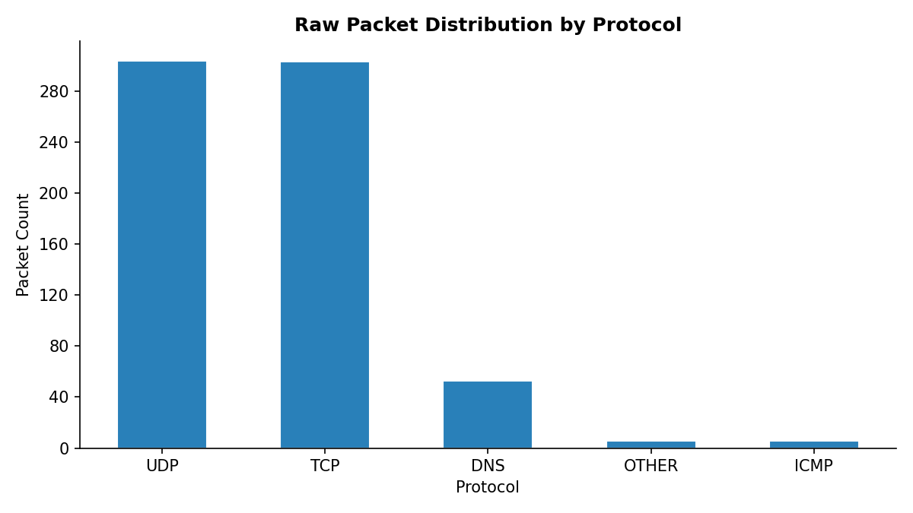

# Network Traffic Risk Assessment
## Executive Report

**Generated:** 2026-04-17 23:25:16  
**Framework:** NIST SP 800-30 Rev. 1 — Qualitative Risk Scoring  
**Threat Intel:** MITRE ATT&CK Enterprise Matrix  

---

## Risk Scoring Methodology

Risk scores are calculated using a qualitative likelihood x impact model, normalised to a 0-100 scale.

| Score Range | Severity Level | Recommended Response                   |
|-------------|----------------|----------------------------------------|
| 80 - 100    | Very High      | Immediate remediation required          |
| 60 - 79     | High           | Prioritise remediation within 24 hours  |
| 40 - 59     | Medium         | Schedule remediation within 7 days      |
| 20 - 39     | Low            | Monitor and review                      |
| 0  - 19     | Very Low       | Informational — log and retain          |

---

## Risk Severity Overview

## Attack Event Breakdown

## Raw Packet Distribution

---

## Top 5 Risk Findings

### Finding 1 — DNS Flood

| Field          | Detail                   |
|----------------|--------------------------|
| Timestamp      | 2026-04-17 23:24:36               |
| Source IP      | ATTACKER                    |
| Destination IP | 172.24.149.49                    |
| Risk Score     | 80.0 / 100            |
| Severity       | Very High               |
| Notes          | Finished DNS Flood                  |

**MITRE ATT&CK — Primary Technique**

| Field     | Detail                                      |
|-----------|---------------------------------------------|
| ID        | [T1498](https://attack.mitre.org/techniques/T1498)     |
| Technique | Network Denial of Service                         |
| Tactic    | Impact                       |

**MITRE ATT&CK — Secondary Techniques**

| ID | Technique | Tactic |
|---|---|---|
| [T1595](https://attack.mitre.org/techniques/T1595) | Active Scanning | Reconnaissance |

### Finding 2 — UDP Flood

| Field          | Detail                   |
|----------------|--------------------------|
| Timestamp      | 2026-04-17 23:24:08               |
| Source IP      | ATTACKER                    |
| Destination IP | 172.24.149.49                    |
| Risk Score     | 80.0 / 100            |
| Severity       | Very High               |
| Notes          | Finished UDP Flood                  |

**MITRE ATT&CK — Primary Technique**

| Field     | Detail                                      |
|-----------|---------------------------------------------|
| ID        | [T1498](https://attack.mitre.org/techniques/T1498)     |
| Technique | Network Denial of Service                         |
| Tactic    | Impact                       |

### Finding 3 — SYN Flood

| Field          | Detail                   |
|----------------|--------------------------|
| Timestamp      | 2026-04-17 23:23:54               |
| Source IP      | ATTACKER                    |
| Destination IP | 172.24.149.49                    |
| Risk Score     | 80.0 / 100            |
| Severity       | Very High               |
| Notes          | Finished SYN Flood                  |

**MITRE ATT&CK — Primary Technique**

| Field     | Detail                                      |
|-----------|---------------------------------------------|
| ID        | [T1498](https://attack.mitre.org/techniques/T1498)     |
| Technique | Network Denial of Service                         |
| Tactic    | Impact                       |

### Finding 4 — DNS Flood

| Field          | Detail                   |
|----------------|--------------------------|
| Timestamp      | 2026-04-17 23:24:36               |
| Source IP      | 10.248.132.116                    |
| Destination IP | 172.24.149.49                    |
| Risk Score     | 64.0 / 100            |
| Severity       | High               |
| Notes          | DNS query/response                  |

**MITRE ATT&CK — Primary Technique**

| Field     | Detail                                      |
|-----------|---------------------------------------------|
| ID        | [T1498](https://attack.mitre.org/techniques/T1498)     |
| Technique | Network Denial of Service                         |
| Tactic    | Impact                       |

**MITRE ATT&CK — Secondary Techniques**

| ID | Technique | Tactic |
|---|---|---|
| [T1595](https://attack.mitre.org/techniques/T1595) | Active Scanning | Reconnaissance |

### Finding 5 — DNS Flood

| Field          | Detail                   |
|----------------|--------------------------|
| Timestamp      | 2026-04-17 23:24:36               |
| Source IP      | 10.182.201.3                    |
| Destination IP | 172.24.149.49                    |
| Risk Score     | 64.0 / 100            |
| Severity       | High               |
| Notes          | DNS query/response                  |

**MITRE ATT&CK — Primary Technique**

| Field     | Detail                                      |
|-----------|---------------------------------------------|
| ID        | [T1498](https://attack.mitre.org/techniques/T1498)     |
| Technique | Network Denial of Service                         |
| Tactic    | Impact                       |

**MITRE ATT&CK — Secondary Techniques**

| ID | Technique | Tactic |
|---|---|---|
| [T1595](https://attack.mitre.org/techniques/T1595) | Active Scanning | Reconnaissance |

---

## Recent Events (Last 50)

| Timestamp | Attack Type | Source IP | Destination IP | Score | Severity | MITRE ID | Tactic |
|---|---|---|---|---|---|---|---|
| 2026-04-17 23:24:36 | Weak TLS Configuration | ATTACKER | 172.24.149.49 | 12.0 | Very Low | [T1562.010](https://attack.mitre.org/techniques/T1562/010) | Defense Evasion |
| 2026-04-17 23:24:36 | Anonymous FTP Access | ATTACKER | 172.24.149.49 | 32.0 | Medium | [T1133](https://attack.mitre.org/techniques/T1133) | Initial Access |
| 2026-04-17 23:24:36 | DNS Flood | ATTACKER | 172.24.149.49 | 80.0 | Very High | [T1498](https://attack.mitre.org/techniques/T1498) | Impact |
| 2026-04-17 23:24:36 | DNS Flood | 10.194.253.51 | 172.24.149.49 | 64.0 | High | [T1498](https://attack.mitre.org/techniques/T1498) | Impact |
| 2026-04-17 23:24:36 | DNS Flood | 10.253.228.102 | 172.24.149.49 | 64.0 | High | [T1498](https://attack.mitre.org/techniques/T1498) | Impact |
| 2026-04-17 23:24:36 | DNS Flood | 10.117.211.151 | 172.24.149.49 | 64.0 | High | [T1498](https://attack.mitre.org/techniques/T1498) | Impact |
| 2026-04-17 23:24:36 | DNS Flood | 10.240.193.32 | 172.24.149.49 | 64.0 | High | [T1498](https://attack.mitre.org/techniques/T1498) | Impact |
| 2026-04-17 23:24:36 | DNS Flood | 10.212.114.176 | 172.24.149.49 | 64.0 | High | [T1498](https://attack.mitre.org/techniques/T1498) | Impact |
| 2026-04-17 23:24:36 | DNS Flood | 10.196.28.68 | 172.24.149.49 | 64.0 | High | [T1498](https://attack.mitre.org/techniques/T1498) | Impact |
| 2026-04-17 23:24:36 | DNS Flood | 10.90.252.70 | 172.24.149.49 | 64.0 | High | [T1498](https://attack.mitre.org/techniques/T1498) | Impact |
| 2026-04-17 23:24:36 | DNS Flood | 10.21.198.221 | 172.24.149.49 | 64.0 | High | [T1498](https://attack.mitre.org/techniques/T1498) | Impact |
| 2026-04-17 23:24:36 | DNS Flood | 10.153.96.29 | 172.24.149.49 | 64.0 | High | [T1498](https://attack.mitre.org/techniques/T1498) | Impact |
| 2026-04-17 23:24:36 | DNS Flood | 10.176.177.45 | 172.24.149.49 | 64.0 | High | [T1498](https://attack.mitre.org/techniques/T1498) | Impact |
| 2026-04-17 23:24:36 | DNS Flood | 10.189.55.5 | 172.24.149.49 | 64.0 | High | [T1498](https://attack.mitre.org/techniques/T1498) | Impact |
| 2026-04-17 23:24:36 | DNS Flood | 10.219.72.223 | 172.24.149.49 | 64.0 | High | [T1498](https://attack.mitre.org/techniques/T1498) | Impact |
| 2026-04-17 23:24:36 | DNS Flood | 10.210.241.95 | 172.24.149.49 | 64.0 | High | [T1498](https://attack.mitre.org/techniques/T1498) | Impact |
| 2026-04-17 23:24:36 | DNS Flood | 10.178.41.100 | 172.24.149.49 | 64.0 | High | [T1498](https://attack.mitre.org/techniques/T1498) | Impact |
| 2026-04-17 23:24:36 | DNS Flood | 10.182.201.3 | 172.24.149.49 | 64.0 | High | [T1498](https://attack.mitre.org/techniques/T1498) | Impact |
| 2026-04-17 23:24:36 | DNS Flood | 10.248.132.116 | 172.24.149.49 | 64.0 | High | [T1498](https://attack.mitre.org/techniques/T1498) | Impact |
| 2026-04-17 23:24:35 | DNS Flood | 10.42.97.83 | 172.24.149.49 | 64.0 | High | [T1498](https://attack.mitre.org/techniques/T1498) | Impact |
| 2026-04-17 23:24:35 | DNS Flood | 10.157.133.150 | 172.24.149.49 | 64.0 | High | [T1498](https://attack.mitre.org/techniques/T1498) | Impact |
| 2026-04-17 23:24:35 | DNS Flood | 10.88.41.167 | 172.24.149.49 | 64.0 | High | [T1498](https://attack.mitre.org/techniques/T1498) | Impact |
| 2026-04-17 23:24:35 | DNS Flood | 10.142.24.200 | 172.24.149.49 | 64.0 | High | [T1498](https://attack.mitre.org/techniques/T1498) | Impact |
| 2026-04-17 23:24:35 | DNS Flood | 10.255.146.126 | 172.24.149.49 | 64.0 | High | [T1498](https://attack.mitre.org/techniques/T1498) | Impact |
| 2026-04-17 23:24:35 | DNS Flood | 10.142.158.128 | 172.24.149.49 | 64.0 | High | [T1498](https://attack.mitre.org/techniques/T1498) | Impact |
| 2026-04-17 23:24:35 | DNS Flood | 10.145.12.39 | 172.24.149.49 | 64.0 | High | [T1498](https://attack.mitre.org/techniques/T1498) | Impact |
| 2026-04-17 23:24:35 | DNS Flood | 10.101.8.151 | 172.24.149.49 | 64.0 | High | [T1498](https://attack.mitre.org/techniques/T1498) | Impact |
| 2026-04-17 23:24:35 | DNS Flood | 10.44.252.248 | 172.24.149.49 | 64.0 | High | [T1498](https://attack.mitre.org/techniques/T1498) | Impact |
| 2026-04-17 23:24:35 | DNS Flood | 10.84.159.152 | 172.24.149.49 | 64.0 | High | [T1498](https://attack.mitre.org/techniques/T1498) | Impact |
| 2026-04-17 23:24:35 | DNS Flood | 10.71.222.51 | 172.24.149.49 | 64.0 | High | [T1498](https://attack.mitre.org/techniques/T1498) | Impact |
| 2026-04-17 23:24:35 | DNS Flood | 10.101.228.30 | 172.24.149.49 | 64.0 | High | [T1498](https://attack.mitre.org/techniques/T1498) | Impact |
| 2026-04-17 23:24:35 | DNS Flood | 10.82.253.172 | 172.24.149.49 | 64.0 | High | [T1498](https://attack.mitre.org/techniques/T1498) | Impact |
| 2026-04-17 23:24:35 | DNS Flood | 10.56.248.116 | 172.24.149.49 | 64.0 | High | [T1498](https://attack.mitre.org/techniques/T1498) | Impact |
| 2026-04-17 23:24:35 | DNS Flood | 10.231.111.83 | 172.24.149.49 | 64.0 | High | [T1498](https://attack.mitre.org/techniques/T1498) | Impact |
| 2026-04-17 23:24:35 | DNS Flood | 10.220.155.20 | 172.24.149.49 | 64.0 | High | [T1498](https://attack.mitre.org/techniques/T1498) | Impact |
| 2026-04-17 23:24:35 | DNS Flood | 10.140.102.225 | 172.24.149.49 | 64.0 | High | [T1498](https://attack.mitre.org/techniques/T1498) | Impact |
| 2026-04-17 23:24:35 | DNS Flood | 10.104.142.204 | 172.24.149.49 | 64.0 | High | [T1498](https://attack.mitre.org/techniques/T1498) | Impact |
| 2026-04-17 23:24:35 | DNS Flood | 10.65.156.139 | 172.24.149.49 | 64.0 | High | [T1498](https://attack.mitre.org/techniques/T1498) | Impact |
| 2026-04-17 23:24:35 | DNS Flood | 10.176.223.229 | 172.24.149.49 | 64.0 | High | [T1498](https://attack.mitre.org/techniques/T1498) | Impact |
| 2026-04-17 23:24:35 | DNS Flood | 10.160.97.162 | 172.24.149.49 | 64.0 | High | [T1498](https://attack.mitre.org/techniques/T1498) | Impact |
| 2026-04-17 23:24:35 | DNS Flood | 10.90.193.90 | 172.24.149.49 | 64.0 | High | [T1498](https://attack.mitre.org/techniques/T1498) | Impact |
| 2026-04-17 23:24:35 | DNS Flood | 10.31.100.234 | 172.24.149.49 | 64.0 | High | [T1498](https://attack.mitre.org/techniques/T1498) | Impact |
| 2026-04-17 23:24:34 | DNS Flood | 10.176.100.105 | 172.24.149.49 | 64.0 | High | [T1498](https://attack.mitre.org/techniques/T1498) | Impact |
| 2026-04-17 23:24:34 | DNS Flood | 10.41.249.194 | 172.24.149.49 | 64.0 | High | [T1498](https://attack.mitre.org/techniques/T1498) | Impact |
| 2026-04-17 23:24:34 | DNS Flood | 10.183.174.31 | 172.24.149.49 | 64.0 | High | [T1498](https://attack.mitre.org/techniques/T1498) | Impact |
| 2026-04-17 23:24:34 | DNS Flood | 10.85.79.26 | 172.24.149.49 | 64.0 | High | [T1498](https://attack.mitre.org/techniques/T1498) | Impact |
| 2026-04-17 23:24:34 | DNS Flood | 10.88.16.217 | 172.24.149.49 | 64.0 | High | [T1498](https://attack.mitre.org/techniques/T1498) | Impact |
| 2026-04-17 23:24:34 | DNS Flood | 10.236.21.184 | 172.24.149.49 | 64.0 | High | [T1498](https://attack.mitre.org/techniques/T1498) | Impact |
| 2026-04-17 23:24:34 | DNS Flood | 10.102.106.240 | 172.24.149.49 | 64.0 | High | [T1498](https://attack.mitre.org/techniques/T1498) | Impact |
| 2026-04-17 23:24:34 | DNS Flood | 10.187.109.164 | 172.24.149.49 | 64.0 | High | [T1498](https://attack.mitre.org/techniques/T1498) | Impact |

---

## Mitigation Recommendations

Recommendations are mapped to NIST CSF functions and MITRE ATT&CK techniques.

### SYN Flood

**MITRE ATT&CK**

| Field        | Detail                                      |
|--------------|---------------------------------------------|
| Primary ID   | [T1498](https://attack.mitre.org/techniques/T1498)     |
| Technique    | Network Denial of Service                         |
| Tactic       | Impact                       |

**Mitigation Steps**

- Enable SYN cookies on all exposed hosts.
- Apply rate limiting for inbound TCP SYN connections at the firewall.
- Deploy an IDS/IPS rule to detect and block SYN flood patterns.
- Consider upstream DDoS scrubbing or a cloud-based DDoS protection service.

**NIST CSF Alignment**

- PR.AC-5  — Network integrity protection
- DE.CM-1  — Continuous network monitoring
- RS.MI-1  — Incident mitigation actions

---

### UDP Flood

**MITRE ATT&CK**

| Field        | Detail                                      |
|--------------|---------------------------------------------|
| Primary ID   | [T1498](https://attack.mitre.org/techniques/T1498)     |
| Technique    | Network Denial of Service                         |
| Tactic       | Impact                       |

**Mitigation Steps**

- Rate-limit inbound UDP traffic at the perimeter firewall.
- Block unused UDP ports to reduce the attack surface.
- Deploy a DDoS protection service capable of absorbing volumetric floods.
- Enable anomaly-based detection for UDP traffic spikes.

**NIST CSF Alignment**

- PR.PT-4  — Communications and control network protection
- DE.CM-7  — Detection of unauthorized connections
- RS.AN-1  — Incident analysis

---

### ICMP Sweep

**MITRE ATT&CK**

| Field        | Detail                                      |
|--------------|---------------------------------------------|
| Primary ID   | [T1018](https://attack.mitre.org/techniques/T1018)     |
| Technique    | Remote System Discovery                         |
| Tactic       | Discovery                       |
| Secondary ID | [T1595.001](https://attack.mitre.org/techniques/T1595/001) — Scanning IP Blocks (Reconnaissance) |

**Mitigation Steps**

- Restrict ICMP echo requests on sensitive hosts via firewall ACLs.
- Enable network scanning detection rules in your IDS/IPS.
- Log and alert on ICMP traffic exceeding baseline thresholds.

**NIST CSF Alignment**

- DE.CM-1  — Network monitoring
- DE.CM-7  — Unauthorized scan detection

---

### Slowloris (HTTP Keep-Alive Exhaustion)

**MITRE ATT&CK**

| Field        | Detail                                      |
|--------------|---------------------------------------------|
| Primary ID   | [T1499](https://attack.mitre.org/techniques/T1499)     |
| Technique    | Endpoint Denial of Service                         |
| Tactic       | Impact                       |
| Secondary ID | [T1498](https://attack.mitre.org/techniques/T1498) — Network Denial of Service (Impact) |

**Mitigation Steps**

- Place a reverse proxy (Nginx or HAProxy) in front of all web services.
- Configure aggressive request timeout and keep-alive limits.
- Enforce maximum concurrent connection limits per source IP.
- Enable connection rate limiting at the load balancer.

**NIST CSF Alignment**

- PR.AC-5  — Application resilience and network integrity
- DE.CM-1  — Connection anomaly detection
- RS.MI-1  — Mitigation of detected incidents

---

### DNS Flood

**MITRE ATT&CK**

| Field        | Detail                                      |
|--------------|---------------------------------------------|
| Primary ID   | [T1498](https://attack.mitre.org/techniques/T1498)     |
| Technique    | Network Denial of Service                         |
| Tactic       | Impact                       |
| Secondary ID | [T1595](https://attack.mitre.org/techniques/T1595) — Active Scanning (Reconnaissance) |

**Mitigation Steps**

- Enable DNS Response Rate Limiting (RRL) on all resolvers.
- Deploy DNSSEC to authenticate DNS responses.
- Rate-limit inbound DNS queries at the network perimeter.
- Harden recursive resolvers and restrict open resolution.

**NIST CSF Alignment**

- PR.PT-4  — Communications protections
- DE.CM-1  — DNS anomaly detection
- RS.MI-1  — Mitigation actions

---

### Anonymous FTP Access

**MITRE ATT&CK**

| Field        | Detail                                      |
|--------------|---------------------------------------------|
| Primary ID   | [T1133](https://attack.mitre.org/techniques/T1133)     |
| Technique    | External Remote Services                         |
| Tactic       | Initial Access                       |
| Secondary ID | [T1078](https://attack.mitre.org/techniques/T1078) — Valid Accounts (Defense Evasion / Persistence) |

**Mitigation Steps**

- Disable anonymous FTP login on all servers immediately.
- Replace FTP with SFTP or FTPS for all file transfer requirements.
- Restrict FTP access to explicitly approved source IP addresses.
- Audit FTP server logs for historical anonymous access attempts.

**NIST CSF Alignment**

- PR.AC-1  — Identity and credential management
- PR.AC-3  — Remote access management
- DE.CM-3  — Personnel and user activity monitoring

---

### Weak TLS Configuration

**MITRE ATT&CK**

| Field        | Detail                                      |
|--------------|---------------------------------------------|
| Primary ID   | [T1562.010](https://attack.mitre.org/techniques/T1562/010)     |
| Technique    | Downgrade Attack                         |
| Tactic       | Defense Evasion                       |
| Secondary ID | [T1040](https://attack.mitre.org/techniques/T1040) — Network Sniffing (Credential Access / Discovery) |

**Mitigation Steps**

- Disable SSLv2, SSLv3, TLS 1.0, and TLS 1.1 across all services.
- Enforce TLS 1.2 at minimum; prefer TLS 1.3.
- Remove weak cipher suites (RC4, DES, 3DES, export-grade ciphers).
- Rotate to certificates signed with SHA-256 or stronger algorithms.
- Run regular TLS configuration scans (e.g., testssl.sh or SSLLabs).

**NIST CSF Alignment**

- PR.DS-2  — Data-in-transit protection
- PR.AC-5  — Network integrity
- DE.CM-8  — Vulnerability scanning

---
